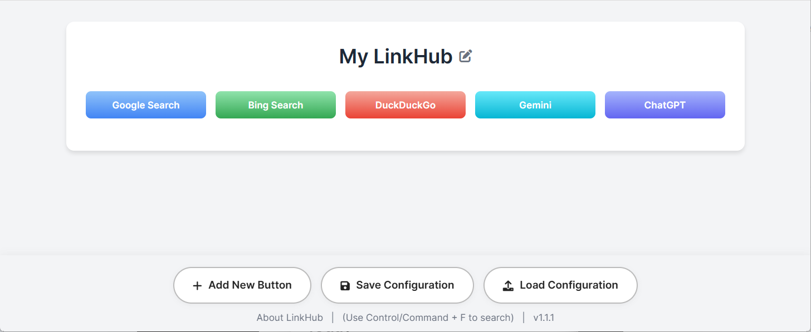

# LinkHub

LinkHub is a customizable homepage for your browser that allows you to easily manage your most-visited links through interactive buttons. You can add, edit, delete, and reorder buttons with ease. All configurations are saved locally, with the option to export and import settings, making it simple to transfer your setup across devices.



## Features

* **Customizable Buttons:** Add, edit, and delete buttons with custom text, link URLs, and colors.
* **Drag-and-Drop Reordering:** Organize your buttons by dragging and dropping them.
* **Title Customization:** Edit the homepage title directly from the UI.
* **Save & Load Configuration:** Export your configuration to a JSON file for backup or use on another device.
* **Cross-Device Access:** Easily access your homepage configuration from any device by saving it to Box Drive, Dropbox, or Google Drive.

## Quick Start

To get started quickly, simply **click the link to `my-homepage.html` in the GitHub repository** ([GitHub repository](https://github.com/pbeens/LinkHub)).

1. Click on `my-homepage.html` in the list of files.
2. Click the **Download Raw File** icon in the top-right corner of the File Preview window.

That's it! The file will be saved locally to your computer. You can now open the `my-homepage.html` file directly in your browser and start adding, editing, and organizing your buttons.

### Setting as Your Browser Homepage

Once you have configured LinkHub, save the `my-homepage.html` file in a convenient location, like Box Drive, Dropbox, or Google Drive. This allows you to set it as your browser's homepage on any computer with access to these services.

* **Chrome:** Go to Settings → On Startup → Open a specific page → Add a new page → Enter the file path or cloud link.
* **Firefox:** Go to Settings → Home → Homepage and new windows → Enter the file path or cloud link.
* **Edge:** Go to Settings → Start, home, and new tabs → Open these pages → Add a new page → Enter the file path or cloud link.

If using a cloud service, make sure the path is accessible, and you are signed in on each computer.

## ⚠️ Caution When Updating

**Important:** If you decide to update `my-homepage.html` by downloading a new version from the repository, it contains the built-in **default configuration**. This means that your current button configuration will be **overwritten**.

To avoid losing your personalized setup:

1. **Save your current configuration** by clicking `Save Configuration` before updating.
2. After updating `my-homepage.html`, **load your saved configuration** by clicking `Load Configuration` and selecting your saved JSON file.

This ensures your buttons and settings remain exactly as you left them.

## Advanced Installation (Optional)

If you wish to **modify the code** or **contribute to the project**, you can clone the repository:

```bash
git clone https://github.com/pbeens/LinkHub.git
```

Navigate to the project directory:

```bash
cd LinkHub
```

Open the `my-homepage.html` file in your preferred browser:

```bash
open my-homepage.html
```

## Configuration File

The configuration is stored in a JSON format. A sample configuration (`default.json`) is included:

```json
{
    "title": "LinkHub Homepage",
    "buttons": [
      {
        "text": "Google Search",
        "link": "https://www.google.com",
        "color": "Blue"
      },
      {
        "text": "Bing Search",
        "link": "https://www.bing.com",
        "color": "Green"
      },
      {
        "text": "DuckDuckGo",
        "link": "https://duckduckgo.com/",
        "color": "Red"
      },
      {
        "text": "Gemini",
        "link": "https://gemini.google.com/",
        "color": "Teal"
      },
      {
        "text": "ChatGPT",
        "link": "https://chatgpt.com/",
        "color": "Indigo"
      }
    ]
  }
```

**Note:** The configuration is saved automatically within the browser's local storage. If you want to maintain a backup or move to another device, be sure to click `Save Configuration` and store the JSON file in a safe location like Box Drive, Dropbox, or Google Drive.

## License

This project is licensed under the MIT License - see the [LICENSE](LICENSE) file for details.

## Changelog

For a detailed history of changes, please refer to the [Changelog](./CHANGELOG.md).

---

Happy Browsing with LinkHub! 🚀
